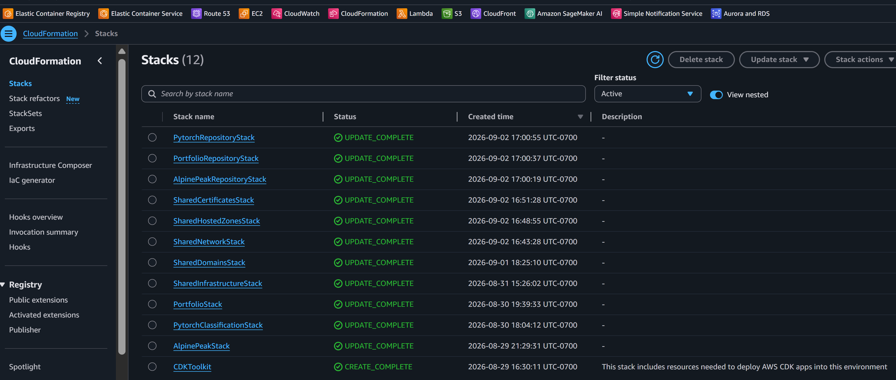

# Shared AWS CDK Infrastructure

Shared infrastructure used by three websites:

- VPC - the private AWS network shared by the websites
- Route 53 hosted zones - the DNS records that connect each domain name to AWS
- ACM certificates - the website identities used to encrypt HTTPS traffic
- Application Load Balancer (ALB) - the public entry point that sends each request to the correct website



These resources are defined here once because all three websites depend on them and no single application should recreate them. Keeping them in dedicated shared stacks prevents an application deployment from accidentally replacing production networking, domains, certificates, or the load balancer.

It also lets the same environment be built in a fresh AWS account without copying resource identifiers from production.

## Ownership

```text
SharedNetworkStack
├── VPC
├── two public subnets
├── internet gateway and public routing
└── dedicated ALB security group

SharedHostedZonesStack
└── Alpine Peak, Portfolio, and Machine Learning hosted zones

SharedCertificatesStack
└── one ACM certificate for each hosted zone

SharedDomainsStack (compatibility export bridge; no domain resources)
└── preserves the existing public hosted-zone and certificate export names

SharedInfrastructureStack
└── consolidated ALB
    ├── HTTP-to-HTTPS listener
    ├── HTTPS listener
    └── all three certificate attachments
```

Application repositories own their own:

- ECR `RepositoryStack`
- Route 53 root A-alias
- listener rule and target group
- application security group
- ECS application resources

Each application has its own GitHub Actions workflow. Routine deployments apply template changes without automatic drift repair; review and resolve manual AWS resource changes separately.

Alpine Peak (ski shop) also defines a dedicated retained RDS security group. The database remains manually configured; attaching the new group and removing the old broad group are separate actions.

## Exports

- Network: `SharedVpcId`, two public-subnet IDs and Availability Zones, and `SharedAlbSecurityGroupId`
- Domains: dedicated owner stacks publish internal `SharedOwned<Site>...` values; the compatibility `SharedDomainsStack` re-exports the existing public `Shared<Site>HostedZoneId` and `Shared<Site>CertificateArn` names
- Load balancer: ARN, DNS name, canonical hosted-zone ID, and `SharedHttpsListenerArn`

Applications read these shared values during deployment instead of storing IDs copied from production. AWS creates different VPC, subnet, security-group, and listener IDs in every environment, and the target account or region may also differ, so hard-coded production values would point to the wrong resources or to resources that do not exist.

## Architecture Benefits

- No hard-coded production resource IDs in application CDK.
- No competing stack ownership of the same resource.
- No circular creation logic between shared infrastructure and applications.
- Fresh-account deployment is defined instead of relying on forgotten console setup.
- Existing production resources were preserved instead of recreated.
- Application deployments can change independently without rebuilding the VPC, load balancer, domains, or certificates.
- Drift-aware deployments can restore CDK-managed settings.

## Deployment order

```text
SharedNetworkStack
SharedHostedZonesStack
  -> SharedCertificatesStack
  -> SharedDomainsStack export bridge
SharedNetworkStack + SharedDomainsStack export bridge
  -> SharedInfrastructureStack
  -> application RepositoryStacks
  -> image pushes
  -> application stacks
```

The order above applies to new environments and routine deployments.

## Fresh-account setup

The existing production account needs none of these steps. Use them only when building the infrastructure in another AWS account.

1. Open `shared_infra/config.py`. Confirm or replace these three domain names before the first deployment:
   - `alpine-peak-climbing-ski-gear.com`
   - `michael-iwanek-portfolio.com`
   - `machine-learning-projects.com`

2. Create an AWS CLI profile for the target account, log in, bootstrap CDK, and create the network and domain address books:

```bash
aws configure sso --profile fresh-account
aws sso login --profile fresh-account
cdk bootstrap --profile fresh-account
cdk deploy SharedNetworkStack SharedHostedZonesStack --profile fresh-account
```

3. In the AWS console, open **Route 53 -> Hosted zones -> each domain** and copy its four name servers. Then open the company where that domain is registered -- **Route 53 -> Registered domains** if AWS is the registrar -- and replace the domain's current name servers with those four values. Repeat this for all three domains.

4. Wait until each domain reports the new name servers:

```bash
nslookup -type=NS alpine-peak-climbing-ski-gear.com
nslookup -type=NS michael-iwanek-portfolio.com
nslookup -type=NS machine-learning-projects.com
```

5. Create the HTTPS certificates, stable domain references, and shared load balancer:

```bash
cdk deploy SharedCertificatesStack SharedDomainsStack SharedInfrastructureStack --profile fresh-account
```

AWS creates the certificate-validation DNS records automatically. Do not copy records from the production account. After the shared stacks finish, deploy each application's repository stack, push its first Docker image, and deploy its application stack.

## Production migration

The completed ownership migration, safety steps, and import command example are documented in [MIGRATION.md](MIGRATION.md). Do not rerun them against the current production account.

## Files

- `app.py` creates the owner stacks, compatibility export bridge, and one-way dependencies.
- `shared_infra/domain_exports_stack.py` keeps those public export names stable after ownership moves.
- `shared_infra/network_stack.py` owns shared networking and the ALB security group.
- `shared_infra/hosted_zones_stack.py` owns hosted zones.
- `shared_infra/certificates_stack.py` owns certificates and consumes hosted-zone exports.
- `shared_infra/stack.py` owns the ALB, listeners, and certificate attachments.
- `shared_infra/config.py` contains portable names and CIDR ranges only.
- `shared_infra/tests/` verifies ownership, retention, exports, and dependencies.
